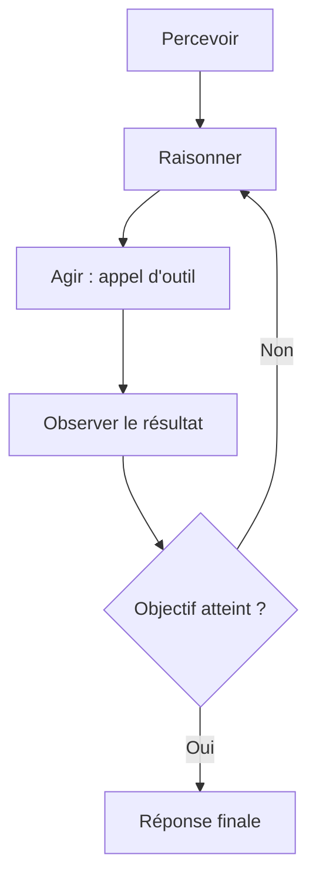

<Info>
  **Niveau** : Avancé · **Prérequis** : [RAG et retrieval](/context-engineering/rag-et-retrieval) · **Temps de lecture** : ~7 min
</Info>

Jusqu'à présent, nous avons traité les modèles de langage comme des systèmes qui *répondent* : vous posez une question, ils génèrent du texte. Les agents IA franchissent une étape supplémentaire : ils **agissent**. Un agent peut effectuer des recherches sur le web, exécuter du code, interroger une base de données, envoyer des emails ou interagir avec des APIs externes, tout cela de manière autonome et en plusieurs étapes successives. Cette capacité à agir dans le monde réel ouvre des possibilités considérables, mais introduit également des risques nouveaux qui demandent une attention particulière.

## Qu'est-ce qu'un agent IA ?

Un agent IA est un système dans lequel un modèle de langage **orchestre une séquence d'actions** pour accomplir un objectif. Contrairement à une simple inférence, l'agent :

- **Perçoit** son environnement (texte, données, résultats d'outils)
- **Raisonne** sur l'état actuel et les prochaines étapes à effectuer
- **Agit** en appelant des outils ou en prenant des décisions
- **Observe** les résultats et ajuste son plan en conséquence

L'agent dispose d'une **mémoire** (l'historique de ses actions et observations), d'un **ensemble d'outils** (fonctions qu'il peut appeler), et d'un **objectif** défini dans son instruction système.

## La boucle agent : percevoir → raisonner → agir → observer

<Steps>
  <Step title="Percevoir">
    L'agent reçoit son entrée initiale : l'objectif défini par l'utilisateur, l'état actuel de l'environnement, les résultats des actions précédentes, et les outils disponibles avec leur description.
  </Step>
  <Step title="Raisonner">
    Le modèle analyse la situation et détermine l'action suivante. Cette étape peut inclure un raisonnement explicite (*chain-of-thought*) : l'agent explique son plan avant d'agir, ce qui améliore la fiabilité.
  </Step>
  <Step title="Agir">
    L'agent sélectionne un outil et formule un appel de fonction structuré (nom de l'outil + paramètres en JSON). Ce n'est pas encore une exécution : c'est une **intention d'action** que le système externe interprète et exécute.
  </Step>
  <Step title="Observer">
    Le résultat de l'exécution de l'outil est renvoyé au modèle sous forme de message. L'agent intègre cette nouvelle information dans son contexte et recommence la boucle jusqu'à ce que l'objectif soit atteint, ou jusqu'à ce qu'il décide de s'arrêter.
  </Step>
</Steps>

Cette boucle se répète jusqu'à ce que l'objectif soit atteint :



## Function calling : comment le modèle appelle des fonctions

Le *function calling* (ou *tool use*) est le mécanisme technique qui permet à un modèle de signaler qu'il souhaite appeler une fonction externe. Voici comment cela fonctionne en pratique :

**1. Définition des outils** (envoyée au modèle avec le prompt) :

```json
{
  "tools": [
    {
      "name": "recherche_web",
      "description": "Effectue une recherche sur le web et retourne les résultats.",
      "parameters": {
        "type": "object",
        "properties": {
          "requete": {
            "type": "string",
            "description": "La requête de recherche"
          },
          "nb_resultats": {
            "type": "integer",
            "description": "Nombre de résultats à retourner (max 10)"
          }
        },
        "required": ["requete"]
      }
    }
  ]
}
```

**2. Appel de l'outil par le modèle** :

```json
{
  "role": "assistant",
  "tool_calls": [
    {
      "id": "call_abc123",
      "type": "function",
      "function": {
        "name": "recherche_web",
        "arguments": "{\"requete\": \"taux directeur BCE juin 2025\", \"nb_resultats\": 5}"
      }
    }
  ]
}
```

**3. Résultat renvoyé au modèle** :

```json
{
  "role": "tool",
  "tool_call_id": "call_abc123",
  "content": "La BCE a maintenu son taux directeur à 2,5 % lors de sa réunion du 5 juin 2025..."
}
```

## MCP : le standard qui connecte les agents à leurs outils

Le function calling que vous venez de voir fonctionne, mais il a une limite pratique : chaque fournisseur de modèle définit son propre format de JSON pour décrire ses outils, et chaque connexion à une source de données externe (fichiers, base de données, dépôt Git, CRM) doit être recodée à la main pour chaque combinaison modèle/outil.

Le **Model Context Protocol** (MCP) répond à ce problème. Lancé par Anthropic en novembre 2024, il s'est imposé en un peu plus d'un an comme le standard de facto pour connecter les modèles de langage à des outils et des sources de données externes : OpenAI, Google DeepMind, Microsoft et AWS l'ont tous adopté dans leurs propres produits. En décembre 2025, Anthropic en a transféré la gouvernance à l'**Agentic AI Foundation**, une fondation neutre hébergée par la Linux Foundation et co-fondée avec Block et OpenAI, pour que le protocole reste ouvert plutôt que contrôlé par une seule entreprise.

Vous pouvez voir le MCP comme un connecteur universel : plutôt que de développer une intégration sur mesure entre chaque modèle et chaque outil, un serveur MCP expose une seule fois ses fonctions, et n'importe quel client compatible (Claude, ChatGPT, un agent que vous construisez vous-même) peut s'y brancher sans code spécifique.

<Tip>
  Ne confondez pas les deux niveaux. Le **function calling**, vu plus haut, est le mécanisme bas niveau qui permet à un modèle de formuler un appel d'outil structuré au sein d'une conversation. Le **MCP** est la couche de standardisation posée par-dessus : il définit comment un serveur d'outils expose ses fonctions, ses données et ses modèles de requêtes de façon uniforme, pour qu'un modèle n'ait plus besoin d'une intégration différente pour chaque source. Un client MCP utilise le function calling en coulisses pour dialoguer avec les outils qu'il découvre via le protocole.
</Tip>

Un serveur MCP peut exposer trois types de ressources à un agent :

- des **outils**, des fonctions appelables comme celles vues dans le function calling (rechercher, écrire un fichier, interroger une API)
- des **ressources**, des données consultables (le contenu d'un fichier, les lignes d'une base de données, une page de documentation)
- des **prompts prédéfinis**, des modèles de requêtes réutilisables fournis par le serveur pour guider certaines tâches

Le MCP standardise la connexion entre un agent et ses outils, mais il existe une couche complémentaire : la communication entre agents. Lancé par Google en avril 2025, le protocole **Agent2Agent** (A2A) permet à des agents développés par des fournisseurs différents de se découvrir, de se déléguer des tâches et de coordonner leur travail, par exemple pour qu'un agent commercial d'une entreprise fasse appel à un agent logistique d'une autre sans intégration sur mesure. A2A est gouverné par la même Agentic AI Foundation que le MCP : les deux protocoles ne sont pas concurrents, l'un relie un agent à ses outils, l'autre relie les agents entre eux. En 2026, le protocole a atteint sa version 1.2 et compte plus de 150 organisations adoptantes en production, parmi lesquelles Microsoft, AWS, Salesforce, SAP, ServiceNow et IBM.

## Types d'outils disponibles

<CardGroup cols={2}>
  <Card title="Recherche et information" icon="magnifying-glass">
    **Recherche web** (Tavily, Brave Search), **requêtes SQL**, **lecture de fichiers**, **appels d'APIs REST**. Permettent à l'agent d'accéder à des informations en temps réel ou dans des systèmes externes.
  </Card>
  <Card title="Exécution de code" icon="code">
    **Interpréteur Python**, **exécution de scripts**, **calculs complexes**, **manipulation de données**. L'agent peut écrire du code, l'exécuter et analyser les résultats, idéal pour l'analyse de données.
  </Card>
  <Card title="Actions système" icon="gear">
    **Gestion de fichiers** (lire, écrire, créer), **navigation web** (browser automation), **envoi d'emails ou messages**. Permettent à l'agent d'agir directement dans un environnement informatique.
  </Card>
  <Card title="Mémoire et contexte" icon="brain">
    **Bases de données vectorielles** (RAG), **mémoire persistante** entre sessions, **gestion de l'état**. Permettent à l'agent de mémoriser des informations sur le long terme et d'accéder à une base de connaissances.
  </Card>
</CardGroup>

## Exemples d'agents en production

**Assistant de recherche** : reçoit une question complexe, décompose en sous-questions, effectue plusieurs recherches web, synthétise les résultats et rédige un rapport structuré avec sources.

**Agent de codage** : lit un repository GitHub, comprend une issue, écrit le code de correction, exécute les tests unitaires, corrige les erreurs détectées et propose une pull request.

**Agent d'automatisation** : reçoit un email client, classifie la demande, consulte le CRM, génère une réponse personnalisée, l'envoie et met à jour le ticket de support.

## Frameworks d'agents

- **LangGraph** (LangChain) : modélise les agents comme des graphes d'état, excellent pour les workflows complexes avec conditions et boucles
- **Microsoft Agent Framework** : SDK de Microsoft pour construire des agents et des workflows multi-agents, disponible en version stable depuis avril 2026. Il unifie et remplace AutoGen et Semantic Kernel, deux anciens frameworks de Microsoft désormais en mode maintenance
- **CrewAI** : orchestration d'équipes d'agents spécialisés avec rôles définis, particulièrement lisible et intuitif

## Risques et précautions avec les agents autonomes

<Warning>
Les agents autonomes peuvent avoir des **effets irréversibles dans le monde réel** : supprimer des fichiers, envoyer des emails, effectuer des achats, modifier des bases de données. Avant de déployer un agent en production, appliquez systématiquement ces précautions :

- **Principe du moindre privilège** : ne donnez à l'agent que les outils strictement nécessaires à sa tâche
- **Mode lecture seule d'abord** : testez avec des outils en lecture seule avant d'activer les actions destructives
- **Human-in-the-loop** : pour les actions à fort impact, imposez une validation humaine avant l'exécution
- **Limite d'itérations** : définissez un nombre maximum de steps pour éviter les boucles infinies
- **Journalisation complète** : enregistrez chaque action et chaque observation pour l'audit et le débogage
- **Sandbox d'abord** : testez toujours dans un environnement isolé avant le déploiement en production
</Warning>

La puissance des agents est proportionnelle à leurs risques. Une architecture d'agent bien conçue commence toujours par définir explicitement ce que l'agent **ne peut pas faire**, avant de définir ce qu'il peut faire.

## Essayez maintenant : simulez une boucle d'agent

Copiez ce prompt dans votre outil IA préféré pour observer comment un modèle planifie une séquence d'appels d'outils, sans les exécuter réellement :

```text
Tu es un agent avec accès aux outils suivants :

1. recherche_web(requete: string) : effectue une recherche sur le web
2. calculatrice(expression: string) : évalue une expression mathématique
3. envoyer_email(destinataire: string, sujet: string, corps: string) : envoie un email

Voici ta tâche : "Trouve le taux de change actuel EUR/USD, calcule combien
valent 3 450 euros en dollars, et envoie le résultat par email à
compta@monentreprise.fr avec pour sujet 'Conversion EUR/USD'."

Réfléchis étape par étape à la séquence d'outils que tu dois appeler, dans
quel ordre, et avec quels paramètres. Pour chaque appel, indique le nom de
l'outil et les arguments au format JSON, sans exécuter réellement l'action.
```

Observez comment le modèle décompose la tâche en étapes (rechercher, puis calculer, puis envoyer) et respecte les dépendances entre elles : il ne peut pas calculer la conversion avant d'avoir le taux, ni envoyer l'email avant d'avoir le résultat. C'est exactement la boucle percevoir → raisonner → agir → observer vue plus haut, ici simulée en un seul prompt plutôt qu'exécutée par un vrai système d'orchestration.

## Testez vos connaissances

<Accordion title="Quiz : Le MCP remplace-t-il le function calling ?">
  **Non.** Le function calling reste le mécanisme bas niveau qui permet à un modèle de formuler un appel d'outil structuré. Le MCP est une couche de standardisation posée par-dessus : il définit comment un serveur d'outils expose ses fonctions de façon uniforme, pour qu'un même agent puisse se connecter à de nombreuses sources sans intégration sur mesure. Un client MCP utilise le function calling en coulisses, il ne s'y substitue pas.
</Accordion>
