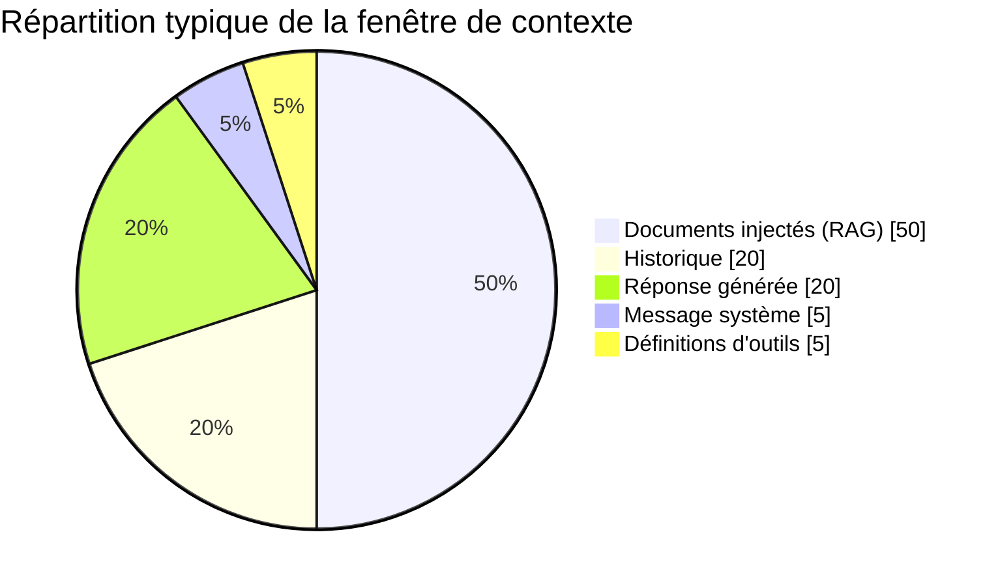

<Info>
  **Niveau** : Intermédiaire · **Prérequis** : Il est recommandé d'avoir lu la leçon sur les [Tokens et Embeddings](/fondamentaux/tokens-et-embeddings) avant d'aborder la fenêtre de contexte. · **Temps de lecture** : ~5 min
</Info>

Chaque modèle de langage possède une capacité maximale d'attention : la **fenêtre de contexte**. Elle représente la quantité totale de texte (vos instructions, l'historique de conversation, les documents injectés et la réponse générée) que le modèle peut traiter en une seule fois. Comprendre cette limite est indispensable pour concevoir des systèmes d'IA robustes qui ne se dégradent pas silencieusement lorsque les échanges s'allongent.

## Qu'est-ce que la fenêtre de contexte ?

La fenêtre de contexte se mesure en **tokens** : des fragments de texte correspondant approximativement à des syllabes ou des mots courts en français. Tout ce que vous envoyez au modèle *et* tout ce qu'il génère en réponse consomme des tokens issus de ce budget commun.

```text
Fenêtre de contexte = tokens d'entrée (input) + tokens de sortie (output)
```

Lorsque la somme dépasse la limite, le modèle ne peut tout simplement plus traiter votre requête, ou, selon l'implémentation, les messages les plus anciens sont silencieusement tronqués, ce qui dégrade la cohérence de la conversation.

## Comparaison des fenêtres de contexte par modèle

Les tailles varient considérablement d'un modèle à l'autre et évoluent rapidement. Voici un aperçu des capacités représentatives au moment de la rédaction :

| Modèle | Fenêtre de contexte | Équivalent approximatif |
|---|---|---|
| GPT-5.6 (OpenAI) | ~1 000 000 tokens | ~750 000 mots / ~1 500 pages |
| Claude Fable 5 (Anthropic) | 1 000 000 tokens | ~750 000 mots / ~1 500 pages |
| Claude Opus 5 / Claude Sonnet 5 (Anthropic) | 1 000 000 tokens | ~750 000 mots / ~1 500 pages |
| Claude Haiku 4.5 (Anthropic) | 200 000 tokens | ~150 000 mots / ~300 pages |
| Gemini 3.1 Pro (Google) | 1 000 000 tokens | ~750 000 mots / ~1 500 pages |
| Gemini 3.6 Flash (Google) | 1 000 000 tokens | ~750 000 mots / ~1 500 pages |
| Muse Spark 1.2 (Meta) | 1 000 000 tokens | ~750 000 mots / ~1 500 pages |
| DeepSeek V4 (DeepSeek, poids ouverts) | 1 000 000 tokens | ~750 000 mots / ~1 500 pages |
| Grok 4.5 (xAI) | 500 000 tokens | ~375 000 mots / ~750 pages |
| Mistral Large 3 (Mistral AI, poids ouverts) | 256 000 tokens | ~192 000 mots / ~384 pages |

> **Règle pratique :** En français, comptez environ **1,3 token par mot** en moyenne (le français étant légèrement plus verbeux que l'anglais en tokens). Une page standard de 250 mots représente environ **325 tokens**.

## Ce qui consomme des tokens

Il est important de comprendre que *tout* ce qui transite par l'API consomme des tokens, pas uniquement le message visible de l'utilisateur :

- **Le message système** (system prompt) : souvent entre 200 et 2 000 tokens
- **L'historique de conversation** : chaque tour accumulé alourdit la facture
- **Les documents et données injectés** (RAG, fichiers) : potentiellement très volumineux
- **Les définitions d'outils** (function calling) : chaque outil déclaré occupe de l'espace
- **La réponse générée** : déduite du budget total disponible

Tous ces éléments se partagent le même budget. Voici une répartition typique de la fenêtre de contexte dans une application RAG :



<Warning>
  ## L'effet "Lost in the Middle"

  Des recherches ont démontré que les LLM accordent une **attention disproportionnée aux informations placées en début et en fin de contexte**, et tendent à négliger les éléments situés au milieu d'un contexte très long. Ce phénomène, appelé *lost in the middle*, peut conduire le modèle à ignorer des instructions critiques ou des faits importants que vous avez pourtant fournis, simplement parce qu'ils étaient enfouis au centre d'un long document. Ne supposez jamais qu'un modèle a "lu" tout votre contexte avec une attention uniforme.
</Warning>

## Calcul rapide : tokens vers pages et mots

Voici un tableau de conversion pratique pour estimer la taille de vos contextes :

| Tokens | Mots (approx.) | Pages A4 (approx.) | Équivalent concret |
|---|---|---|---|
| 1 000 | ~750 | ~1,5 | Un court article de blog |
| 4 000 | ~3 000 | ~6 | Un rapport de réunion détaillé |
| 16 000 | ~12 000 | ~24 | Une nouvelle courte |
| 128 000 | ~96 000 | ~192 | Un roman de taille moyenne |
| 200 000 | ~150 000 | ~300 | Un long roman ou une thèse |
| 1 000 000 | ~750 000 | ~1 500 | Plusieurs livres entiers |

## Stratégies quand vous approchez de la limite

Atteindre la limite de contexte n'est pas une fatalité : c'est un problème d'ingénierie qui se gère avec les bonnes stratégies.

**1. Résumé de conversation**
Compressez périodiquement l'historique des échanges en un résumé condensé que vous réinjectez en début de contexte. Vous conservez l'essentiel de la continuité sans stocker chaque tour.

**2. Retrieval-Augmented Generation (RAG)**
Plutôt que d'injecter tous vos documents, stockez-les dans une base vectorielle et ne récupérez que les passages réellement pertinents à chaque requête.

**3. Fenêtre glissante**
Pour les très longues conversations, ne conservez que les N derniers tours dans le contexte actif, tout en archivant l'historique complet pour d'éventuelles recherches.

**4. Compression et déduplication**
Supprimez les répétitions, résumez les sections prolixes, et retirez les informations qui ne sont plus pertinentes au stade actuel de la conversation.

**5. Hiérarchisation des informations**
Identifiez ce qui est indispensable (instructions système, faits clés) versus ce qui est accessoire, et élaguez en conséquence.

<Tip>
  Placez toujours vos informations les plus importantes (instructions critiques, contraintes absolues, données de référence) **au début ou à la fin** de votre contexte. C'est là que le modèle porte le plus d'attention, indépendamment de la longueur totale du contexte. Ne laissez jamais une instruction vitale se perdre au milieu d'un long document.
</Tip>

## En résumé

La fenêtre de contexte est à la fois votre espace de travail et votre principal goulot d'étranglement. Connaître sa taille, savoir ce qui la consomme et anticiper ses limites vous permet de concevoir des architectures d'IA plus résilientes. Dans la section suivante, nous verrons comment simuler une mémoire persistante pour dépasser cette contrainte structurelle.

## Testez vos connaissances

<Accordion title="Quiz : Que se passe-t-il si j'envoie 100 000 tokens à un modèle ayant une fenêtre de 100 000 tokens ?">
  **Réponse :** Le modèle n'aura plus d'espace pour générer sa réponse (0 token de sortie disponible) et la requête échouera ou sera tronquée. N'oubliez jamais que la fenêtre de contexte inclut à la fois l'entrée (input) ET la sortie (output) !
</Accordion>

