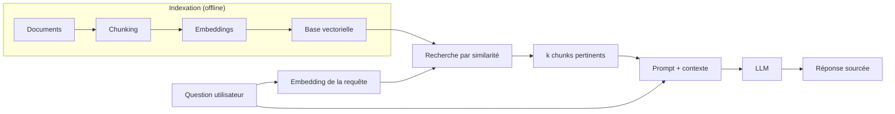

Les modèles de langage sont entraînés sur des données figées à une date précise : leur *date de coupure*. Ils ne connaissent pas vos documents internes, vos bases de données propriétaires, ni les actualités récentes. Le **RAG (Retrieval-Augmented Generation)** résout ce problème en connectant le modèle à une source de données externe au moment de la génération : plutôt que de demander au modèle de mémoriser toute la connaissance utile, on lui fournit dynamiquement les informations pertinentes dans le contexte. C'est l'une des architectures les plus puissantes et les plus répandues dans les applications IA en production.

## Qu'est-ce que le RAG ?

Le RAG est une architecture qui combine deux composants distincts :

- **Un système de retrieval** (récupération) : une base vectorielle ou un moteur de recherche qui identifie les documents les plus pertinents pour une requête donnée
- **Un modèle de génération** : le LLM qui produit la réponse finale en s'appuyant sur les documents récupérés

Le modèle ne génère pas à partir de sa mémoire interne seule : il *lit* les documents fournis et synthétise une réponse ancrée dans vos données réelles.

## Pourquoi utiliser le RAG ?

Le RAG répond à plusieurs limitations fondamentales des LLMs :

- **Dépasser la date de coupure** : vos données sont mises à jour indépendamment du modèle
- **Utiliser des données privées** : documentation interne, contrats, bases clients, etc.
- **Réduire les hallucinations** : le modèle s'appuie sur des sources vérifiables
- **Citer les sources** : vous pouvez tracer d'où vient chaque information
- **Éviter le fine-tuning** : pas besoin de ré-entraîner le modèle pour chaque mise à jour de données

## Le pipeline RAG en 3 grandes étapes

<Steps>
  <Step title="Indexation (offline)">
    Préparez et stockez vos documents dans une base vectorielle. Cette étape se fait une fois (puis en incrémental lors des mises à jour).

    - **Chargement** : importez vos documents (PDF, Word, HTML, base de données, etc.)
    - **Chunking** : découpez chaque document en segments (chunks) de taille adaptée
    - **Embedding** : convertissez chaque chunk en vecteur numérique via un modèle d'embedding
    - **Stockage** : indexez les vecteurs dans une base vectorielle (Pinecone, Weaviate, Chroma, pgvector...)
  </Step>
  <Step title="Récupération (retrieval, online)">
    Lorsqu'une question est posée, retrouvez les chunks les plus pertinents.

    - **Embedding de la requête** : convertissez la question en vecteur avec le même modèle d'embedding
    - **Recherche par similarité** : calculez la distance cosinus entre le vecteur requête et tous les vecteurs indexés
    - **Sélection** : récupérez les *k* chunks les plus proches (typiquement 3 à 10)
    - **Reranking (optionnel)** : affinez la sélection avec un modèle de reranking pour améliorer la précision
  </Step>
  <Step title="Génération (online)">
    Construisez le contexte et obtenez la réponse finale.

    - **Assemblage du contexte** : injectez les chunks récupérés dans le prompt
    - **Prompt structuré** : encadrez les documents avec des délimiteurs clairs (voir la page sur la structuration)
    - **Génération** : le LLM produit une réponse en se basant sur les documents fournis
    - **Post-traitement** : extrayez les sources citées et formatez la réponse
  </Step>
</Steps>

L'ensemble du pipeline, de l'indexation hors ligne à la génération en direct, se visualise ainsi :

## Le chunking : découper intelligemment

Le chunking est l'étape la plus sous-estimée du pipeline RAG. Un mauvais découpage dégrade directement la qualité de récupération.

<Note>
Il n'existe pas de taille de chunk universelle. Un chunk trop petit perd le contexte local (une phrase isolée peut être ambiguë) ; un chunk trop grand dilue le signal de pertinence et consomme beaucoup de tokens. La taille typique se situe entre **256 et 1024 tokens**, avec un chevauchement (*overlap*) de 10 à 20 % pour éviter de couper des idées en deux.
</Note>

Les principales stratégies de chunking :

| Stratégie | Description | Idéal pour |
|---|---|---|
| **Taille fixe** | Chunks de N tokens avec overlap | Textes homogènes, démarrage rapide |
| **Par structure** | Découpage selon les titres, paragraphes | Documentation, articles structurés |
| **Sémantique** | Regroupement par unité de sens | Textes complexes, qualité maximale |
| **Hiérarchique** | Plusieurs niveaux (résumé + détail) | Longs documents avec table des matières |

## Les embeddings pour la recherche sémantique

Un embedding est une représentation numérique dense d'un texte dans un espace vectoriel à haute dimension. Des textes sémantiquement proches ont des vecteurs proches dans cet espace : c'est ce qui permet de retrouver des documents pertinents même si la question n'utilise pas exactement les mêmes mots que le document.

Modèles d'embedding populaires :

- **`text-embedding-3-large`** (OpenAI) : haute qualité, 3072 dimensions
- **`embed-v3`** (Cohere) : excellent pour le multilinguisme
- **`all-MiniLM-L6-v2`** (open source, via HuggingFace) : léger et rapide
- **`multilingual-e5-large`** (open source) : fort sur le français et les langues européennes

## Outils et frameworks RAG

<CardGroup cols={2}>
  <Card title="LlamaIndex" icon="database" href="https://www.llamaindex.ai">
    Framework spécialisé dans l'ingestion, le chunking et la récupération de données. Idéal pour construire rapidement un pipeline RAG robuste avec de nombreux connecteurs de données natifs.
  </Card>
  <Card title="LangChain" icon="link" href="https://www.langchain.com">
    Framework généraliste pour les applications LLM. Propose des composants RAG modulaires (loaders, splitters, retrievers) facilement combinables avec d'autres chaînes.
  </Card>
  <Card title="Haystack" icon="magnifying-glass" href="https://haystack.deepset.ai">
    Framework orienté recherche et question-réponse. Particulièrement adapté aux cas d'usage documentaires d'entreprise avec pipeline de retrieval avancé.
  </Card>
  <Card title="Bases vectorielles" icon="layer-group">
    **Pinecone** (managed, scalable), **Weaviate** (open source, hybride), **Chroma** (léger, local), **pgvector** (extension PostgreSQL). Le choix dépend de votre infrastructure existante.
  </Card>
</CardGroup>

## RAG vs Fine-tuning : quand choisir quoi ?

Ces deux approches répondent à des besoins différents et sont souvent complémentaires :

| Critère | RAG | Fine-tuning |
|---|---|---|
| **Données évolutives** | ✅ Mise à jour facile | ❌ Ré-entraînement nécessaire |
| **Données privées volumineuses** | ✅ Idéal | ⚠️ Coûteux et complexe |
| **Style ou comportement spécifique** | ⚠️ Limité | ✅ Excellent |
| **Connaissances très spécialisées** | ✅ Bon | ✅ Très bon |
| **Coût de mise en œuvre** | Modéré | Élevé |
| **Traçabilité des sources** | ✅ Native | ❌ Difficile |

En règle générale : utilisez le RAG pour injecter des **connaissances**, et le fine-tuning pour modifier le **comportement** du modèle.
