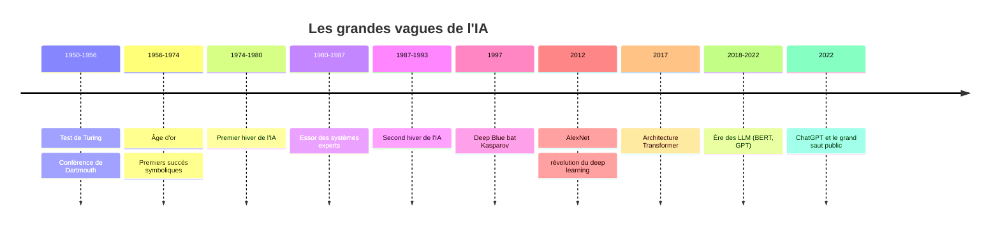

<Info>
  **Niveau** : Débutant · **Prérequis** : [Qu'est-ce que l'IA ?](/fondamentaux/quest-ce-que-lia) · **Temps de lecture** : ~6 min
</Info>

L'histoire de l'intelligence artificielle est tout sauf linéaire. C'est un récit fait d'enthousiasmes débordants, de désillusions profondes et de renaissances spectaculaires. Comprendre cette trajectoire n'est pas qu'une curiosité historique : cela vous aide à mieux saisir pourquoi les outils d'IA d'aujourd'hui fonctionnent comme ils fonctionnent, et pourquoi certaines promesses (longtemps restées lettre morte) sont enfin en train de se concrétiser.

## Les grandes étapes en un coup d'œil

L'IA moderne est le fruit de plus de 70 ans de recherches, de paris scientifiques audacieux et d'innovations technologiques. Voici la chronologie des moments clés qui ont façonné le domaine.

<Steps>
  <Step title="1950 : Alan Turing pose la question fondamentale">
    Le mathématicien britannique **Alan Turing** publie son article fondateur *Computing Machinery and Intelligence*, dans lequel il pose la question : *"Les machines peuvent-elles penser ?"* Pour y répondre de façon opérationnelle, il propose le célèbre **test de Turing** : si un humain ne peut pas distinguer, dans une conversation écrite, une machine d'un autre humain, alors on peut considérer que la machine "pense". Ce test, bien que controversé aujourd'hui, a structuré les ambitions du domaine pendant des décennies.
  </Step>
  <Step title="1956 : Naissance officielle de l'IA (conférence de Dartmouth)">
    **John McCarthy**, **Marvin Minsky** et leurs collègues organisent la conférence de Dartmouth, considérée comme l'acte de naissance officiel de l'IA comme discipline scientifique. C'est McCarthy qui forge le terme *"artificial intelligence"*. Les chercheurs présents sont convaincus qu'une machine capable de simuler tous les aspects de l'intelligence humaine pourrait être construite en une génération. L'optimisme est total.
  </Step>
  <Step title="1956–1974 : L'âge d'or et les premiers succès">
    Les premières décennies sont marquées par des résultats impressionnants pour l'époque : des programmes capables de résoudre des problèmes de logique, de jouer aux dames ou de démontrer des théorèmes mathématiques. Les financements affluent, notamment de l'armée américaine. Les chercheurs prédisent qu'une IA de niveau humain sera atteinte d'ici 10 à 20 ans. Cette confiance s'avèrera très prématurée.
  </Step>
  <Step title="1974–1980 : Le premier hiver de l'IA">
    Les promesses n'ont pas été tenues. Les ordinateurs de l'époque manquent cruellement de puissance de calcul et de données. Les approches symboliques (fondées sur des règles logiques écrites à la main) se heurtent à la complexité du monde réel. Les financements publics s'assèchent drastiquement, notamment au Royaume-Uni après le rapport Lighthill (1973) et aux États-Unis via les coupes du DARPA. La recherche entre dans une période de stagnation que l'on appellera rétrospectivement le **premier hiver de l'IA**.
  </Step>
  <Step title="1980–1987 : Le renouveau des systèmes experts">
    L'IA renaît grâce aux **systèmes experts** : des programmes qui encodent la connaissance de spécialistes humains sous forme de milliers de règles "si… alors…". Des entreprises comme Digital Equipment Corporation économisent des millions de dollars grâce à ces systèmes. Le Japon lance son ambitieux projet de "5ème génération". L'enthousiasme revient, les investissements aussi.
  </Step>
  <Step title="1987–1993 : Le second hiver de l'IA">
    L'effondrement du marché des ordinateurs Lisp (utilisés pour les systèmes experts), couplé aux résultats décevants du projet japonais, provoque un **deuxième refroidissement brutal**. Le terme même "intelligence artificielle" devient un repoussoir dans les demandes de financement. Les chercheurs lui préfèrent des dénominations plus discrètes : *machine learning*, *computer vision*, *data mining*…
  </Step>
  <Step title="1997 : Deep Blue bat Kasparov">
    Le supercalculateur **Deep Blue** d'IBM bat le champion du monde d'échecs Garry Kasparov. C'est un tournant symbolique majeur, même si Deep Blue n'utilise pas de machine learning : il évalue des millions de positions par force brute. L'événement marque l'imaginaire collectif et relance l'intérêt public pour l'IA.
  </Step>
  <Step title="2006–2012 : La renaissance du deep learning">
    **Geoffrey Hinton**, **Yoshua Bengio** et **Yann LeCun** (qui recevront ensemble le prix Turing en 2018) persistent dans leur conviction que les réseaux de neurones profonds sont la bonne voie, malgré le scepticisme généralisé. En 2006, Hinton démontre qu'on peut entraîner efficacement des réseaux à plusieurs couches. En **2012**, l'équipe de Hinton remporte le concours ImageNet avec le réseau **AlexNet**, réduisant le taux d'erreur de reconnaissance d'images de près de 40 % par rapport aux méthodes précédentes. C'est le moment charnière qui lance la révolution du deep learning.
  </Step>
  <Step title="2017 : L'architecture Transformer change tout">
    Des chercheurs de Google publient l'article *"Attention Is All You Need"*, introduisant l'**architecture Transformer**. Cette innovation permet de traiter les séquences de texte en parallèle plutôt que séquentiellement, rendant l'entraînement de modèles géants enfin praticable. Presque tous les modèles de langage modernes (GPT, BERT, LLaMA, Gemini) reposent sur cette architecture.
  </Step>
  <Step title="2018–2022 : L'ère des grands modèles de langage (LLM)">
    **BERT** (Google, 2018), puis **GPT-2** (OpenAI, 2019), **GPT-3** (2020) et enfin **GPT-4** (2023) montrent qu'en augmentant massivement la taille des modèles et les données d'entraînement, on obtient des capacités émergentes surprenantes : raisonnement, résumé, traduction, génération de code… Le monde de la recherche est fasciné, parfois inquiet.
  </Step>
  <Step title="Novembre 2022 : ChatGPT et le grand saut grand public">
    OpenAI lance **ChatGPT**, qui atteint 100 millions d'utilisateurs en seulement 2 mois, un record de croissance. Pour la première fois, une IA conversationnelle de niveau avancé est accessible à tous, sans compétences techniques. L'IA entre définitivement dans le quotidien du grand public, des entreprises et des gouvernements. Le monde bascule dans l'**ère des IA génératives**.
  </Step>
</Steps>

<Tip>
**Pourquoi le deep learning a-t-il enfin fonctionné après 2012 ?** Trois facteurs se sont alignés simultanément, ce qu'on appelle parfois le "triangle magique" : (1) la **puissance de calcul** a explosé grâce aux GPU (conçus initialement pour les jeux vidéo) ; (2) les **données** sont devenues abondantes grâce à Internet ; (3) les **algorithmes** ont mûri avec des décennies de recherche discrète. Aucun de ces trois éléments seul n'aurait suffi. C'est leur convergence qui a tout changé.
</Tip>

## Le test de Turing : toujours pertinent ?

Le test de Turing a été conçu en 1950 comme un critère opérationnel d'intelligence. Aujourd'hui, des modèles comme GPT-4 sont capables de passer ce test avec aisance dans de nombreux contextes. Pourtant, cela ne signifie pas qu'ils "pensent" au sens humain.

Ce paradoxe illustre une leçon essentielle de l'histoire de l'IA : **les objectifs que l'on croit impossibles deviennent, une fois atteints, insuffisants pour définir l'intelligence.** C'est ce que le chercheur Douglas Hofstadter a appelé le "déplacement des poteaux". Résoudre des équations, jouer aux échecs, écrire des textes cohérents… chaque fois qu'une machine y parvient, on dit que "ce n'était finalement pas vraiment de l'intelligence".

## Pourquoi connaître cette histoire ?

Comprendre les hivers de l'IA vous donne une grille de lecture précieuse pour évaluer les annonces actuelles avec discernement. Chaque vague d'enthousiasme a été suivie de déceptions lorsque la réalité technique n'a pas tenu le rythme des promesses. Nous vivons aujourd'hui une troisième vague (la plus puissante), mais garder un regard critique reste essentiel.

Dans le prochain chapitre, nous allons disséquer les différentes familles techniques qui composent le paysage de l'IA moderne : machine learning, deep learning et modèles de langage.

## Testez vos connaissances

<Accordion title="Quiz : Deep Blue, qui a battu Kasparov en 1997, est-il un exemple de machine learning ?">
  **Non.** Deep Blue n'apprenait pas à partir de données : il évaluait par force brute des millions de positions d'échecs possibles grâce à sa puissance de calcul, en s'appuyant sur des règles et une évaluation programmées à l'avance. C'est une différence essentielle avec le machine learning, où le système découvre lui-même des patterns à partir d'exemples. Deep Blue est un exploit d'ingénierie symbolique, pas un ancêtre des LLM actuels.
</Accordion>
