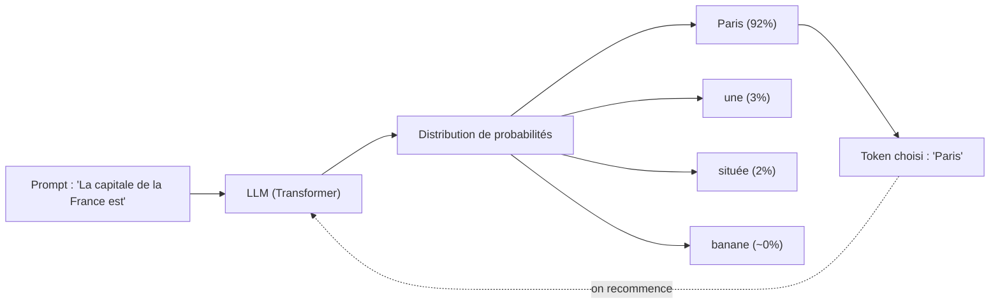

<Info>
  **Niveau** : Intermédiaire · **Prérequis** : [Les types d'IA](/fondamentaux/types-dia) · **Temps de lecture** : ~5 min
</Info>

Les grands modèles de langage, ou **LLM** (*Large Language Models*), sont au cœur de la révolution de l'intelligence artificielle générative. Avant de savoir les utiliser efficacement, il est essentiel de comprendre ce qu'ils sont réellement, comment ils fonctionnent, et quelles sont leurs différentes formes. Cette page vous offre une introduction claire, sans formules mathématiques complexes.

## Qu'est-ce qu'un modèle de langage ?

Un modèle de langage est un programme capable de **comprendre et de générer du texte** en langue naturelle. Il est entraîné sur d'immenses quantités de textes (livres, articles, pages web, code source…) afin d'apprendre les structures, les patterns et les relations entre les mots d'une langue.

L'objectif fondamental d'un modèle de langage est simple : **prédire la suite d'un texte**. Donnez-lui le début d'une phrase, et il vous propose la continuation la plus probable.

## Comment un LLM prédit le prochain mot

Imaginons que vous écriviez : *"La capitale de la France est…"*. Le modèle analyse tous les mots qui précèdent et calcule une **distribution de probabilités** sur les mots susceptibles de suivre. Dans ce cas, le mot *"Paris"* obtient une probabilité très élevée, tandis que *"banane"* en obtient une quasi nulle.

Ce mécanisme de prédiction est répété token par token (nous verrons ce concept dans la prochaine leçon), jusqu'à former une réponse complète. En apparence, cela peut ressembler à de la compréhension, mais il s'agit fondamentalement d'un calcul statistique extrêmement sophistiqué.

<Note>
Un LLM ne "sait" pas que Paris est la capitale de la France au sens où un humain le sait. Il a appris que, dans des millions de textes, le mot "Paris" suit très fréquemment l'expression "capitale de la France". Cette distinction est cruciale pour comprendre les limites des modèles.
</Note>

Voici comment se déroule cette prédiction, répétée token après token :

## L'architecture Transformer

La quasi-totalité des LLM modernes repose sur une architecture appelée **Transformer**, introduite par Google en 2017 dans l'article *"Attention Is All You Need"*. Voici ses concepts clés, expliqués simplement :

**Le mécanisme d'attention** permet au modèle de "regarder" l'ensemble du texte en entrée simultanément, plutôt que de le lire mot par mot. Il peut ainsi établir des relations entre des mots éloignés dans une phrase : dans *"La banque sur laquelle il s'est assis se trouvait près de la rivière"*, le modèle comprend que "banque" désigne un banc, et non un établissement financier, grâce au contexte fourni par "rivière".

**Les couches et les paramètres** sont les "neurones" du modèle. Un LLM comme GPT-5.6 ou Claude Sonnet 5 possède des centaines de milliards de paramètres : des valeurs numériques ajustées lors de l'entraînement pour encoder les connaissances du modèle.

**Le contexte** (ou fenêtre de contexte) est la quantité de texte que le modèle peut "voir" à la fois lors de la génération d'une réponse. Plus la fenêtre est grande, plus le modèle peut tenir compte d'informations passées dans la conversation.

## Les LLM populaires

Aujourd'hui, plusieurs grands modèles se distinguent par leurs performances et leurs caractéristiques propres.

<CardGroup cols={2}>
  <Card title="GPT-5.6" icon="robot" href="https://openai.com">
    Développé par **OpenAI**, GPT-5.6 est l'un des modèles les plus puissants et polyvalents. Il intègre texte, images et audio dans un seul modèle multimodal.
  </Card>
  <Card title="Claude" icon="sparkles" href="https://anthropic.com">
    Développé par **Anthropic**, Claude est réputé pour ses longues fenêtres de contexte, sa capacité de raisonnement et son alignement sur des valeurs de sécurité. Claude Fable 5 est aujourd'hui le modèle phare de la gamme, avec Claude Opus 5 comme alternative plus économique.
  </Card>
  <Card title="Gemini" icon="gem" href="https://deepmind.google">
    Développé par **Google DeepMind**, Gemini est nativement multimodal et profondément intégré à l'écosystème Google (Search, Workspace, etc.).
  </Card>
  <Card title="Mistral, Llama & DeepSeek" icon="code" href="https://mistral.ai">
    **Mistral** (français) et **DeepSeek** (chinois) proposent des modèles **open-source** ou à poids ouverts, particulièrement appréciés pour leur déploiement local et leur transparence. DeepSeek V4, publié sous licence MIT, illustre la montée en puissance de ces alternatives ouvertes face aux modèles propriétaires. Meta a longtemps suivi cette voie avec sa famille **Llama**, toujours téléchargeable, mais met désormais en avant **Muse Spark**, un modèle propriétaire à poids fermés devenu la vitrine du groupe depuis avril 2026. En août 2026, Meta a toutefois réintroduit un modèle à poids ouverts, **Muse Glimmer**, sous licence Apache 2.0, aux côtés de Muse Spark.
  </Card>
  <Card title="Grok" icon="bolt" href="https://x.ai">
    Développé par **xAI**, Grok est intégré à la plateforme X et mise sur un accès à l'information en temps réel. Grok 4.6, sorti en août 2026, est son modèle phare, orienté raisonnement et code.
  </Card>
</CardGroup>

## Modèle de base vs modèle ajusté par instruction

Il existe deux grandes catégories de LLM que vous rencontrerez :

**Le modèle de base (*base model*)** est le résultat brut du pré-entraînement. Il est entraîné uniquement à prédire le texte suivant. Si vous lui posez une question, il risque de… continuer votre question plutôt que d'y répondre ! Ce type de modèle est rarement utilisé directement par les utilisateurs finaux.

**Le modèle ajusté par instruction (*instruction-tuned model*)** a subi une phase d'entraînement supplémentaire (notamment via le RLHF, que nous aborderons dans la leçon sur l'entraînement) pour apprendre à **suivre des instructions** et à adopter un format de conversation question-réponse. C'est ce type de modèle qui alimente ChatGPT, Claude.ai ou Gemini.

| Caractéristique | Modèle de base | Modèle instruction-tuned |
|---|---|---|
| Comportement | Complète le texte | Répond aux questions |
| Utilisation directe | Non recommandée | Recommandée |
| Cas d'usage principal | Fine-tuning avancé | Chatbots, assistants, API |
| Exemple | GPT-5.6 base | GPT-5.6, Claude Sonnet 5, Gemini 3.1 Pro |

## Ce que vous retenez de cette leçon

Vous savez désormais qu'un LLM est un modèle probabiliste basé sur l'architecture Transformer, entraîné à prédire le texte suivant sur d'immenses corpus. Les modèles que vous utilisez au quotidien sont des versions *instruction-tuned*, affinées pour répondre à vos demandes. Dans la prochaine leçon, nous allons descendre d'un niveau et découvrir la notion de **token** : la vraie unité de base du langage pour un LLM.

## Testez vos connaissances

<Accordion title="Quiz : Si vous posez une question directe à un modèle de base (non instruction-tuned), que va-t-il probablement se passer ?">
  **Il va continuer votre texte plutôt que d'y répondre.** Un modèle de base n'a appris qu'une seule chose : prédire la suite la plus probable d'un texte. Face à une question, la continuation la plus probable statistiquement peut être une autre question, une liste de questions similaires, ou une suite de phrase, mais pas nécessairement une réponse. C'est justement le rôle du fine-tuning par instruction (SFT puis RLHF) que d'apprendre au modèle à adopter le format question-réponse que vous connaissez avec ChatGPT ou Claude.
</Accordion>
