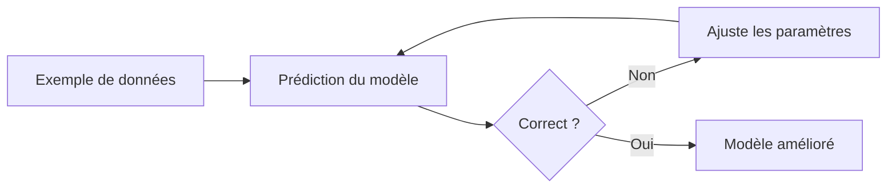

<Info>
  **Niveau** : Débutant · **Prérequis** : aucun · **Temps de lecture** : ~5 min
</Info>

L'intelligence artificielle est aujourd'hui partout : dans votre téléphone, dans vos recommandations de films, dans les outils que vous utilisez au travail. Pourtant, derrière ce terme se cache une réalité bien plus précise et nuancée que ce que les médias laissent souvent entendre. Dans ce chapitre, nous allons démystifier l'IA, comprendre ce qu'elle est vraiment et tracer la frontière entre ce qu'elle sait faire et ce qui reste hors de sa portée.

## Définition : qu'est-ce que l'IA ?

L'intelligence artificielle désigne l'ensemble des techniques permettant à une machine d'accomplir des tâches qui, si elles étaient réalisées par un humain, nécessiteraient de l'intelligence. Cette définition, formulée dès les années 1950, reste étonnamment pertinente aujourd'hui.

Plus concrètement, une IA est un système informatique capable de :

- **percevoir** son environnement (texte, images, sons, données) ;
- **raisonner** ou identifier des patterns dans ces informations ;
- **agir** en conséquence, que ce soit en produisant une réponse, une décision ou une prédiction.

<Note>
L'IA n'est pas une technologie unique : c'est un vaste domaine qui regroupe de nombreuses approches différentes : règles expertes, apprentissage automatique, réseaux de neurones, et bien d'autres. Quand on parle d'"IA" aujourd'hui, on fait le plus souvent référence au **machine learning**, et plus particulièrement au **deep learning**.
</Note>

## Comment les machines "apprennent" ?

Contrairement aux logiciels traditionnels (où un programmeur écrit explicitement chaque règle), le **machine learning** (apprentissage automatique) permet à une machine d'apprendre à partir de données, sans qu'on lui programme chaque cas de figure.

Imaginez que vous vouliez créer un programme capable de reconnaître des photos de chats. Vous pourriez écrire des milliers de règles : "si des oreilles pointues, si des moustaches, si…" Cela serait interminable et peu fiable. À la place, le machine learning consiste à **montrer des milliers d'exemples** au système (des photos de chats et de non-chats) et à le laisser découvrir lui-même les caractéristiques discriminantes. Plus il voit d'exemples, plus il s'améliore.

Ce processus d'apprentissage repose sur un cycle simple :

1. Le modèle fait une prédiction sur un exemple.
2. On lui indique si cette prédiction est correcte ou non.
3. Il ajuste ses paramètres internes pour faire mieux la prochaine fois.
4. On répète cette opération des millions de fois.

Ce cycle d'apprentissage peut se représenter simplement par le schéma suivant :

## IA étroite vs IA générale

Il est essentiel de distinguer deux catégories conceptuelles d'IA, souvent confondues dans les discussions grand public.

| | IA étroite (ANI) | IA générale (AGI) |
|---|---|---|
| **Définition** | Excellente dans une tâche spécifique | Capable de s'adapter à n'importe quelle tâche cognitive |
| **Existe-t-elle ?** | Oui, partout autour de nous | Non, pas encore |
| **Exemples** | ChatGPT, AlphaGo, filtres anti-spam | Concept théorique |
| **Limites** | Rigide hors de son domaine | Inconnues |

**Toutes les IA que vous utilisez aujourd'hui sont des IA étroites.** Un modèle de traduction automatique est remarquable pour traduire, mais incapable de jouer aux échecs. Un champion d'échecs IA ne peut pas rédiger un email. Chaque système est optimisé pour un périmètre précis.

L'**IA générale** (une machine capable de raisonner, apprendre et s'adapter comme un être humain dans n'importe quel contexte) reste un objectif de recherche, sans horizon temporel certain.

## L'IA au quotidien : vous l'utilisez déjà

L'IA s'est glissée dans notre quotidien de façon si naturelle qu'on oublie souvent qu'elle est là. Voici quelques exemples concrets que vous connaissez certainement :

<CardGroup cols={2}>
  <Card title="🎬 Recommandations de contenu" icon="film">
    Netflix, Spotify et YouTube analysent vos habitudes de visionnage ou d'écoute pour vous suggérer ce que vous aimerez probablement regarder ou écouter ensuite. Ces systèmes de **filtrage collaboratif** comparent votre profil à des millions d'autres utilisateurs similaires.
  </Card>
  <Card title="🎙️ Assistants vocaux" icon="microphone">
    Siri, Google Assistant et Alexa combinent plusieurs IA : une pour la **reconnaissance vocale** (transformer votre voix en texte), une pour la **compréhension du langage** (saisir votre intention) et une pour générer une réponse pertinente.
  </Card>
  <Card title="🌍 Traduction automatique" icon="language">
    Google Traduction et DeepL utilisent des modèles de deep learning entraînés sur des milliards de paires de phrases. La qualité a fait un bond spectaculaire depuis l'introduction des **réseaux de neurones** en 2016, rendant la traduction quasi-instantanée et souvent très naturelle.
  </Card>
  <Card title="📧 Filtres anti-spam" icon="envelope">
    Votre messagerie classe automatiquement des centaines de mails par jour. Ces filtres apprennent en continu à partir des messages que vous marquez comme spam, s'adaptant aux nouvelles techniques des expéditeurs malveillants.
  </Card>
  <Card title="📸 Reconnaissance d'images" icon="camera">
    Quand votre téléphone identifie les visages sur vos photos, qu'une appli lit un code QR ou qu'un système de caisse automatique reconnaît un article, c'est du **deep learning** appliqué à la vision par ordinateur.
  </Card>
  <Card title="✍️ Aide à la rédaction" icon="pen">
    Les correcteurs orthographiques intelligents, la complétion automatique dans Gmail ou sur votre téléphone, et bien sûr les assistants comme ChatGPT ou Copilot : tous utilisent des **modèles de langage** pour prédire ou générer du texte.
  </Card>
</CardGroup>

## Ce que l'IA fait bien… et ce qu'elle ne fait pas

Comprendre les forces et les limites de l'IA est fondamental pour l'utiliser intelligemment, et c'est précisément l'objectif de ce cours.

### Ce que l'IA fait bien

- **Traiter de très grandes quantités de données** rapidement et sans fatigue.
- **Reconnaître des patterns** dans des données complexes (images, textes, sons).
- **Générer du contenu** (textes, images, code) de façon fluide et cohérente.
- **Automatiser des tâches répétitives** à forte valeur cognitive apparente.
- **Trouver des corrélations** invisibles à l'œil humain dans des jeux de données massifs.

### Ce que l'IA ne fait pas (encore)

- **Comprendre réellement** ce qu'elle traite : un LLM prédit des mots, il ne "pense" pas.
- **Raisonner de façon fiable** sur des problèmes nécessitant une logique formelle rigoureuse.
- **Se souvenir** d'une conversation à l'autre, sauf si on lui donne explicitement ce contexte.
- **Être créative** au sens humain du terme : elle recombine ce qu'elle a vu, sans véritable invention ex nihilo.
- **Garantir la vérité** : les modèles de langage peuvent "halluciner" des informations fausses avec une confiance apparente.

---

Dans le prochain chapitre, nous remonterons aux origines de l'IA pour comprendre comment cette discipline est née, a failli mourir deux fois, et connaît aujourd'hui une renaissance sans précédent.

## Testez vos connaissances

<Accordion title="Quiz : Si ChatGPT sait discuter aussi bien de cuisine, de droit ou de physique, s'agit-il d'une IA générale (AGI) ?">
  **Non.** ChatGPT reste une IA étroite, même si son domaine d'application (le langage) lui permet d'aborder énormément de sujets différents. La polyvalence apparente ne doit pas être confondue avec l'intelligence générale : le modèle ne raisonne pas, n'apprend pas de nouvelles tâches à la volée et ne s'adapte pas à des contextes radicalement différents de ceux pour lesquels il a été entraîné (agir dans le monde physique, par exemple). Il reste excellent dans un domaine précis : générer et manipuler du texte.
</Accordion>
