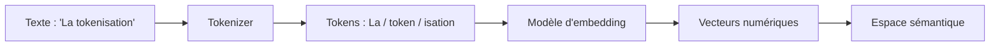

Quand vous envoyez un message à un LLM, le modèle ne lit pas votre texte comme vous le faites. Il le décompose d'abord en petites unités appelées **tokens**, puis transforme chacune d'elles en une représentation mathématique appelée **embedding**. Comprendre ces deux concepts vous aidera à mieux utiliser les modèles, à maîtriser vos coûts et à saisir pourquoi certains textes posent plus de problèmes que d'autres.

## Qu'est-ce qu'un token ?

Un token n'est **pas** forcément un mot entier. C'est une unité de texte définie par le **tokenizer** du modèle : un algorithme qui découpe le texte de la façon la plus efficace possible en se basant sur les fréquences observées dans les données d'entraînement.

Voici quelques exemples concrets de tokenisation :

- **"bonjour"** → `["bon", "jour"]` (2 tokens)
- **"tokenisation"** → `["token", "isation"]` (2 tokens)
- **"ChatGPT"** → `["Chat", "G", "PT"]` (3 tokens)
- **"IA"** → `["IA"]` (1 token)
- **" Paris"** → `[" Paris"]` (1 token, notez l'espace inclus)
- **"anticonstitutionnellement"** → `["anti", "const", "itu", "tion", "nelle", "ment"]` (6 tokens)

Les mots courants ont tendance à former un seul token, tandis que les mots rares, les néologismes ou les mots dans des langues moins représentées dans les données d'entraînement sont découpés en plusieurs tokens.

```python
# Exemple de tokenisation avec la bibliothèque tiktoken (OpenAI)
import tiktoken

enc = tiktoken.encoding_for_model("gpt-4o")

texte = "La tokenisation est fascinante."
tokens = enc.encode(texte)

print(f"Texte    : {texte}")
print(f"Tokens   : {tokens}")
print(f"Nombre   : {len(tokens)}")

# Afficher chaque token décodé individuellement
for token_id in tokens:
    print(f"  {token_id} → '{enc.decode([token_id])}'")

# Output attendu :
# Texte    : La tokenisation est fascinante.
# Tokens   : [986, 36233, 374, 47075, 13]  ← IDs numériques
# Nombre   : 5
#   986    → 'La'
#   36233  → ' token'       ← espace inclus dans le token
#   ...
```

Du texte brut jusqu'aux vecteurs manipulés par le modèle, le parcours se résume ainsi :



## Pourquoi les tokens sont importants

Les tokens sont l'unité de mesure fondamentale des LLM pour deux raisons majeures :

**1. Le coût** : les API de LLM facturent à la consommation de tokens (tokens en entrée + tokens générés en sortie). Un prompt verbeux coûte plus cher qu'un prompt concis qui obtient le même résultat.

**2. La limite de contexte** : chaque modèle a une **fenêtre de contexte maximale**, exprimée en tokens. GPT-4o supporte jusqu'à 128 000 tokens ; Claude 3 peut aller jusqu'à 200 000 tokens. Au-delà, le modèle ne peut plus "voir" les informations les plus anciennes de la conversation.

<Tip>
Pour économiser des tokens sans perdre en qualité, préférez des instructions directes et précises à de longues formulations polies. Écrire *"Résume en 3 points"* consomme moins de tokens que *"Pourriez-vous s'il vous plaît me faire un résumé en trois points ?"*, et produit souvent un résultat équivalent ou meilleur.
</Tip>

## Tokens en français vs en anglais

Une règle empirique utile : en anglais, **1 token ≈ 4 caractères**, soit environ ¾ d'un mot. En français (et dans la plupart des langues non-anglaises), le rapport est légèrement moins favorable, car les tokenizers sont généralement optimisés sur des corpus à dominante anglaise.

| Langue | Ratio approximatif | Exemple |
|---|---|---|
| Anglais | ~1 token / 4 caractères | "hello world" → 2 tokens |
| Français | ~1 token / 3,5 caractères | "bonjour monde" → 3-4 tokens |
| Chinois / Japonais | ~1-2 caractères / token | Très variable selon le modèle |

Cette différence peut représenter jusqu'à 20-30 % de tokens supplémentaires pour un même contenu traduit de l'anglais vers le français. Cela a un impact direct sur vos coûts et sur l'utilisation de votre fenêtre de contexte.

## Qu'est-ce qu'un embedding ?

Une fois le texte tokenisé, chaque token est converti en un **vecteur numérique** : c'est ce qu'on appelle un **embedding**. Concrètement, un embedding est une liste de nombres (souvent plusieurs centaines ou milliers de valeurs) qui représente la "position" d'un mot dans un espace mathématique à haute dimension.

Ce qui rend les embeddings puissants, c'est qu'ils **capturent la sémantique** : des mots au sens similaire ont des vecteurs proches les uns des autres dans cet espace. Des mots au sens opposé ou sans rapport sont éloignés.

L'exemple le plus célèbre de cette propriété :

```
vecteur("roi") - vecteur("homme") + vecteur("femme") ≈ vecteur("reine")
```

Cela signifie que le modèle a appris, à travers les données d'entraînement, que la relation entre "roi" et "homme" est analogue à celle entre "reine" et "femme", et cette relation est encodée géométriquement dans l'espace vectoriel.

D'autres exemples de relations capturées par les embeddings :

- *"Paris" - "France" + "Italie" ≈ "Rome"* (relation capitale / pays)
- *"chaud" est proche de "tiède", "brûlant", "chaleur"*
- *"positif" est à l'opposé de "négatif"*

## À quoi servent les embeddings en pratique ?

<Info>
Les embeddings sont la technologie sous-jacente de nombreuses applications d'IA au-delà de la génération de texte :

- **Recherche sémantique** : trouver des documents pertinents même si les mots exacts ne correspondent pas (ex. : chercher "voiture" et trouver des résultats sur "automobile").
- **Systèmes de recommandation** : suggérer des contenus similaires sur YouTube, Netflix ou Spotify.
- **Détection de doublons** : identifier des textes qui disent la même chose avec des formulations différentes.
- **Classification** : catégoriser automatiquement des emails, des avis clients ou des tickets de support.
- **RAG (Retrieval-Augmented Generation)** : enrichir les réponses d'un LLM avec des documents pertinents issus d'une base de connaissance.
</Info>

## Ce que vous retenez de cette leçon

Les tokens sont les unités atomiques du texte pour un LLM : ni des mots, ni des caractères, mais quelque chose entre les deux. Ils déterminent vos coûts et vos limites de contexte. Les embeddings, eux, sont des représentations vectorielles qui permettent au modèle de "comprendre" le sens et les relations entre les concepts. Dans la prochaine leçon, nous allons explorer comment ces fondations sont construites : le processus d'**entraînement et de fine-tuning**.
