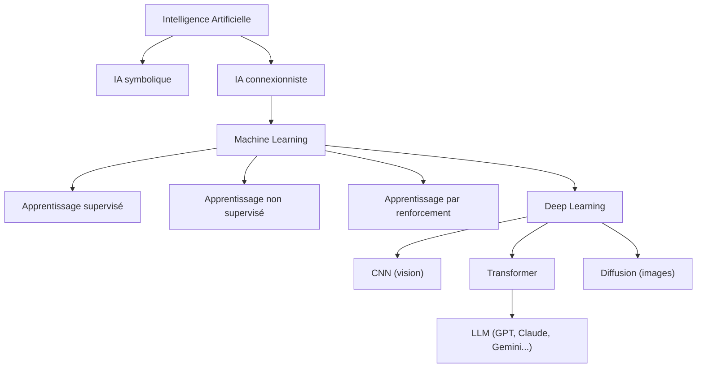

<Info>
  **Niveau** : Débutant · **Prérequis** : [Histoire et évolution de l'IA](/fondamentaux/histoire-et-evolution) · **Temps de lecture** : ~9 min
</Info>

Quand on parle d'"IA", on désigne en réalité une famille de technologies très différentes les unes des autres. Un filtre anti-spam, un réseau de neurones qui reconnaît des tumeurs sur des images médicales et un modèle de langage comme ChatGPT n'ont pas grand-chose en commun, si ce n'est qu'ils font tous partie du grand arbre généalogique de l'intelligence artificielle. Dans ce chapitre, nous allons cartographier cet arbre, en comprenant comment chaque branche se distingue et pourquoi cette distinction compte pour vous en tant que praticien·ne de l'IA.

## IA symbolique vs IA connectionniste : les deux grandes familles

Depuis les origines, l'IA a été traversée par une tension fondamentale entre deux visions radicalement différentes de l'intelligence artificielle.

| | IA symbolique | IA connectionniste |
|---|---|---|
| **Principe** | Encoder la connaissance sous forme de règles logiques explicites | Apprendre à partir de données, par ajustement de paramètres numériques |
| **Métaphore** | Un expert qui rédige un manuel de règles | Un enfant qui apprend par l'expérience et l'imitation |
| **Forces** | Explicable, prévisible, fiable dans un périmètre strict | Flexible, performant sur des données complexes et non structurées |
| **Faiblesses** | Ne passe pas à l'échelle, fragile hors périmètre | Boîte noire, gourmand en données et en calcul |
| **Exemples** | Systèmes experts, moteurs de règles, calculateurs symboliques | Machine learning, deep learning, LLM |

Aujourd'hui, l'IA connectionniste (et particulièrement le deep learning) domine les applications grand public. Mais l'IA symbolique n'a pas disparu : elle est parfois combinée avec l'apprentissage automatique dans des approches **hybrides** (neuro-symboliques), notamment pour des domaines à forte exigence de fiabilité comme le médical ou le juridique.

<Info>
L'IA générative que vous utilisez au quotidien (ChatGPT, Gemini, Claude, Mistral…) est entièrement connectionniste. Elle n'applique aucune règle logique explicite : elle génère du texte en prédisant le mot le plus probable en fonction du contexte, grâce à des milliards de paramètres appris sur d'immenses corpus textuels.
</Info>

## Trois grandes approches en détail

<Tabs>
  <Tab title="Machine Learning">
    ## Le machine learning : apprendre à partir des données

    Le **machine learning** (ML) est la branche de l'IA qui donne aux ordinateurs la capacité d'apprendre sans être explicitement programmés pour chaque tâche. Plutôt que d'écrire des règles à la main, on fournit au système des données et un objectif, et il découvre lui-même les patterns pertinents.

    ### Les trois grandes familles d'apprentissage

    #### 1. Apprentissage supervisé
    Le système apprend à partir d'exemples **étiquetés** : chaque donnée d'entraînement est accompagnée de la réponse correcte.

    - **Comment ça marche** : on montre 10 000 photos de chats (avec l'étiquette "chat") et 10 000 photos d'autres animaux. Le modèle apprend à distinguer les deux.
    - **Exemples concrets** : classification d'emails (spam/non-spam), prédiction du prix d'un appartement, diagnostic médical à partir d'images, détection de fraude bancaire.
    - **Analogie** : un élève qui apprend avec des exercices corrigés.

    #### 2. Apprentissage non supervisé
    Le système reçoit des données **sans étiquettes** et doit trouver lui-même une structure cachée.

    - **Comment ça marche** : on donne des milliers de profils clients sans aucune catégorie prédéfinie. Le modèle identifie des groupes naturels (clusters) aux comportements similaires.
    - **Exemples concrets** : segmentation de clientèle, détection d'anomalies, compression de données, recommandation de contenu.
    - **Analogie** : un explorateur qui cartographie un territoire inconnu sans carte de référence.

    #### 3. Apprentissage par renforcement
    Un **agent** apprend en interagissant avec un environnement : il reçoit des récompenses ou des pénalités selon ses actions et optimise sa stratégie pour maximiser les récompenses sur le long terme.

    - **Comment ça marche** : l'agent essaie des actions, observe le résultat (récompense positive ou négative) et ajuste son comportement. Il n'a pas besoin d'exemples préalables.
    - **Exemples concrets** : AlphaGo (Go), les IA de jeux vidéo, le réglage fin des LLM (RLHF : Reinforcement Learning from Human Feedback), les robots industriels.
    - **Analogie** : apprendre à faire du vélo par essais et erreurs, sans que personne ne vous explique les règles.

    <Note>
    **RLHF et ChatGPT** : les grands modèles de langage comme ChatGPT ne sont pas uniquement entraînés par apprentissage supervisé. Ils sont ensuite affinés par **renforcement à partir de feedbacks humains** (RLHF) : des évaluateurs humains notent les réponses du modèle, et ces notes servent à orienter le modèle vers des réponses plus utiles, plus sûres et plus alignées avec les préférences humaines.
    </Note>
  </Tab>

  <Tab title="Deep Learning">
    ## Le deep learning : l'intelligence par les neurones artificiels

    Le **deep learning** (apprentissage profond) est une sous-catégorie du machine learning qui utilise des **réseaux de neurones artificiels à de nombreuses couches**. C'est lui qui est responsable des percées les plus spectaculaires des dix dernières années : reconnaissance vocale, vision par ordinateur, génération de texte et d'images.

    ### Qu'est-ce qu'un réseau de neurones artificiel ?

    Inspiré (de façon très lointaine) du cerveau humain, un réseau de neurones artificiel est composé de :

    - **Neurones artificiels** : de simples fonctions mathématiques qui reçoivent des entrées numériques et produisent une sortie.
    - **Couches** : les neurones sont organisés en couches successives : une couche d'entrée, des couches cachées, une couche de sortie.
    - **Connexions pondérées** : chaque connexion entre neurones a un **poids** (un nombre) qui détermine l'importance de ce signal. C'est l'ajustement de ces millions (ou milliards) de poids lors de l'entraînement qui constitue l'apprentissage.

    ### Pourquoi "profond" ?

    Le qualificatif "profond" (deep) fait référence au **nombre de couches cachées** dans le réseau. Les réseaux superficiels des années 1980 avaient une ou deux couches. Les réseaux modernes en ont des dizaines, des centaines, voire des milliers. Cette profondeur permet au réseau de construire des **représentations hiérarchiques** de plus en plus abstraites :

    - Dans un réseau de reconnaissance d'images, les premières couches détectent des contours simples, les couches intermédiaires des formes, les couches profondes des objets complets.
    - Dans un réseau de traitement du langage, les premières couches capturent des relations syntaxiques locales, les couches profondes des nuances sémantiques complexes.

    ### Les architectures clés du deep learning

    | Architecture | Usage principal | Exemple célèbre |
    |---|---|---|
    | **CNN** (Réseaux convolutifs) | Images, vidéos | AlexNet, ResNet |
    | **RNN / LSTM** | Séquences temporelles, texte | Traduction des années 2016–2017 |
    | **Transformer** | Texte, images, audio | GPT, BERT, Whisper, DALL·E |
    | **GAN** | Génération d'images | Deepfakes, StyleGAN |
    | **Diffusion** | Génération d'images HD | Stable Diffusion, Midjourney |

    <Note>
    **Deep learning ≠ cerveau humain.** Malgré l'analogie avec les neurones, un réseau de neurones artificiel est avant tout une fonction mathématique très complexe. Il n'y a pas de conscience, pas de compréhension, pas d'expérience subjective. L'analogie biologique a été utile pour l'inspiration, mais elle est trompeuse si on la prend trop au pied de la lettre.
    </Note>
  </Tab>

  <Tab title="LLM">
    ## Les LLM : le deep learning appliqué au langage

    Les **Large Language Models** (grands modèles de langage, ou LLM) sont des modèles de deep learning entraînés spécifiquement sur d'immenses quantités de texte, dans le but de comprendre et de générer du langage naturel. Ils représentent l'état de l'art actuel de l'IA générative et constituent le cœur de ce cours.

    ### Comment fonctionne un LLM ?

    Un LLM est entraîné sur une tâche en apparence simple : **prédire le prochain mot** (ou token) dans une séquence. Cette tâche, répétée des milliards de fois sur des centaines de milliards de mots, force le modèle à développer une représentation interne extraordinairement riche du langage, du monde et des raisonnements humains.

    Le processus d'entraînement d'un LLM se déroule en plusieurs phases :

    1. **Pré-entraînement** : le modèle ingère des téraoctets de texte (livres, articles, code, sites web) et apprend à prédire le prochain token. C'est de loin la phase la plus coûteuse.
    2. **Fine-tuning supervisé (SFT)** : le modèle est affiné sur des exemples de conversations de haute qualité, annotées par des humains, pour apprendre à être un assistant utile.
    3. **RLHF** : le modèle est optimisé par renforcement à partir de préférences humaines, pour améliorer sa fiabilité, sa sécurité et sa pertinence.

    ### Pourquoi les LLM sont-ils si capables ?

    La clé réside dans l'**architecture Transformer** et le mécanisme d'**attention**. Contrairement aux réseaux récurrents (RNN), qui traitaient le texte mot par mot de façon séquentielle, un Transformer peut examiner **toutes les relations entre tous les tokens d'un texte en parallèle**. Cela lui permet de saisir des dépendances à longue distance (le sens d'un mot au début d'un long paragraphe peut influencer l'interprétation d'un mot à la fin) et d'être entraîné beaucoup plus efficacement sur GPU.

    ### Les LLM et les capacités émergentes

    Un phénomène fascinant et encore mal compris : à partir d'une certaine taille, les LLM développent des **capacités émergentes** : des aptitudes qui n'étaient pas explicitement entraînées et qui apparaissent soudainement quand le modèle franchit un seuil de taille. Traduction de langues jamais vues pendant l'entraînement, raisonnement arithmétique, résolution d'analogies… Ces phénomènes d'émergence sont au cœur des débats actuels sur la nature de ces modèles.

    ### Les LLM les plus connus aujourd'hui

    | Modèle | Organisation | Particularité |
    |---|---|---|
    | **GPT-5.6** | OpenAI | Multimodal (texte, image, audio) |
    | **Claude Opus 5 / Sonnet 5** | Anthropic | Contexte très long (1 million de tokens), sécurité avancée |
    | **Gemini 3.1 Pro** | Google DeepMind | Fenêtre de contexte d'1 million de tokens |
    | **Muse Spark** | Meta | Modèle phare propriétaire (poids fermés), contexte d'1 million de tokens |
    | **Mistral Large 3** | Mistral AI | Français, open source, efficace |

    Meta a longtemps mis en avant sa famille **Llama**, à poids ouverts et toujours téléchargeable. Depuis avril 2026, l'entreprise met plutôt en avant **Muse Spark**, un modèle fermé développé par sa nouvelle division Meta Superintelligence Labs. En août 2026, Meta a toutefois publié **Muse Glimmer**, un modèle à poids ouverts sous licence Apache 2.0, aux côtés de Muse Spark.

    <Note>
    **Les LLM ne "savent" pas, ils prédisent.** C'est une distinction cruciale pour bien les utiliser. Quand un LLM vous répond, il ne consulte pas une base de données de faits vérifiés : il génère la suite de texte la plus probable compte tenu du contexte. C'est pourquoi il peut produire des affirmations fausses formulées avec une grande assurance, un phénomène appelé **hallucination**. Savoir cela vous rend un bien meilleur utilisateur de ces outils.
    </Note>
  </Tab>
</Tabs>

## Où se situent ces technologies les unes par rapport aux autres ?

Pour conclure, voici une vue synthétique qui résume les relations d'inclusion entre ces concepts :

```text
Intelligence Artificielle (IA)
├── IA symbolique (systèmes experts, logique formelle)
└── IA connectionniste
    └── Machine Learning (ML)
        ├── Apprentissage supervisé
        ├── Apprentissage non supervisé
        ├── Apprentissage par renforcement
        └── Deep Learning
            ├── CNN (vision)
            ├── Transformer (langage, multimodal)
            │   └── LLM (GPT, Claude, Gemini, LLaMA…)
            └── Diffusion (génération d'images)
```

Le même arbre, sous forme de schéma :



**Le deep learning est une sous-famille du machine learning, lui-même une sous-famille de l'IA.** Les LLM sont un type particulier de deep learning basé sur l'architecture Transformer. Quand vous utilisez ChatGPT, vous utilisez donc simultanément de l'IA, du machine learning, du deep learning et un LLM, les quatre niveaux en même temps.

---

Maintenant que vous maîtrisez les fondamentaux conceptuels de l'IA, nous allons entrer dans le vif du sujet : comment communiquer efficacement avec ces systèmes grâce au **prompt engineering**.

## Testez vos connaissances

<Accordion title="Quiz : Le deep learning et le machine learning sont-ils deux catégories distinctes et parallèles ?">
  **Non.** Le deep learning est une sous-catégorie du machine learning, pas une branche séparée. Le machine learning regroupe l'ensemble des techniques qui apprennent à partir de données (supervisé, non supervisé, par renforcement), et le deep learning est l'une de ces techniques : celle qui utilise des réseaux de neurones à de nombreuses couches. Tous les LLM sont donc à la fois du deep learning, du machine learning et de l'IA connexionniste, les trois niveaux s'emboîtent.
</Accordion>
