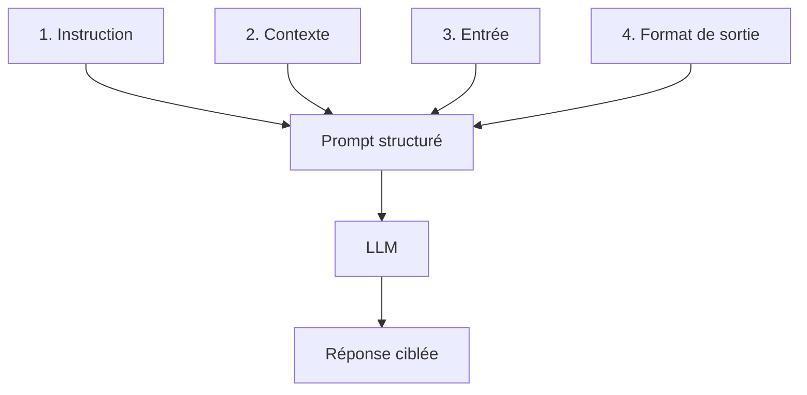

Un prompt efficace n'est pas une simple phrase rédigée à la hâte : c'est une structure pensée, composée d'éléments précis qui guident le modèle vers la réponse que vous attendez. Comprendre l'anatomie d'un prompt, c'est comme apprendre la grammaire d'une nouvelle langue : une fois les règles intégrées, vous pouvez construire n'importe quelle phrase avec assurance et précision.

## Les quatre composantes d'un prompt structuré

Tout prompt peut être analysé et construit à partir de quatre composantes fondamentales. Chacune joue un rôle distinct et complémentaire. Certaines sont indispensables, d'autres optionnelles selon le contexte, nous y reviendrons.

<Steps>
  <Step title="L'instruction : ce que vous voulez que le modèle fasse">
    L'**instruction** est le cœur de votre prompt. C'est l'action que vous demandez au modèle d'accomplir. Elle doit être exprimée avec un verbe d'action clair et sans ambiguïté.

    **Exemples de verbes d'instruction courants :**
    - Résume, traduis, rédige, analyse, compare, liste, explique, corrige, génère, classe…

    ```text
    # Instruction faible (ambiguë)
    "Fais quelque chose avec ce texte."

    # Instruction forte (claire et actionnable)
    "Résume ce texte en identifiant les trois idées principales."
    ```

    **Règle d'or :** une instruction = une action principale. Si vous avez plusieurs tâches à accomplir, envisagez plusieurs prompts distincts ou précisez explicitement l'ordre d'exécution.
  </Step>

  <Step title="Le contexte : les informations de fond nécessaires">
    Le **contexte** fournit au modèle les informations de fond qui lui permettent d'adapter sa réponse à votre situation spécifique. Sans contexte, le modèle répond de façon générique ; avec un contexte pertinent, il devient un véritable expert de votre situation.

    Le contexte peut inclure :
    - Votre rôle ou celui du lecteur cible
    - Le secteur d'activité ou le domaine concerné
    - Les contraintes ou hypothèses importantes
    - L'objectif final derrière la demande

    ```text
    # Sans contexte
    "Rédige un e-mail de relance."

    # Avec contexte
    "Je suis consultant freelance en UX design. Mon client n'a pas répondu
    à mon devis depuis deux semaines. Rédige un e-mail de relance
    professionnel mais chaleureux."
    ```
  </Step>

  <Step title="L'entrée : les données ou le texte à traiter">
    L'**entrée** (ou *input*) désigne les données concrètes que vous soumettez au modèle pour qu'il les traite. Il peut s'agir d'un texte à analyser, d'un document à résumer, d'un code à corriger, ou encore d'une liste d'éléments à organiser.

    Il est recommandé d'utiliser des **délimiteurs** (triples guillemets, balises XML, tirets, etc.) pour séparer clairement votre entrée du reste du prompt.

    ```text
    # Entrée sans délimiteur (risque de confusion)
    "Traduis en anglais : Je suis ravi de vous rencontrer enfin."

    # Entrée avec délimiteur (claire et sans ambiguïté)
    "Traduis le texte suivant en anglais professionnel.

    Texte à traduire :
    \"\"\"
    Je suis ravi de vous rencontrer enfin. Votre réputation dans
    le secteur vous précède depuis longtemps.
    \"\"\""
    ```
  </Step>

  <Step title="Le format de sortie : comment vous voulez la réponse">
    Le **format de sortie** indique au modèle sous quelle forme vous souhaitez recevoir la réponse. C'est souvent la composante la plus négligée, et pourtant l'une des plus impactantes.

    Vous pouvez spécifier :
    - La longueur (nombre de mots, de phrases, de paragraphes)
    - La structure (liste à puces, tableau, JSON, markdown…)
    - Le ton (formel, conversationnel, technique, pédagogique…)
    - La langue ou le niveau de vocabulaire

    ```text
    # Sans format de sortie
    "Donne-moi des idées de noms pour mon application."

    # Avec format de sortie précis
    "Propose 5 noms pour mon application de suivi des habitudes.
    Pour chaque nom, donne : le nom, une phrase d'accroche de 10 mots
    maximum, et le niveau de disponibilité probable en tant que domaine
    .com (élevé / moyen / faible). Présente le résultat en tableau."
    ```

    <Note>
      Les instructions de format sont particulièrement puissantes lorsque vous intégrez les réponses du modèle dans un processus automatisé. Demander une sortie en JSON structuré, par exemple, vous permet de traiter directement le résultat sans nettoyage manuel.
    </Note>
  </Step>
</Steps>

Ces quatre composantes s'assemblent pour former un prompt qui guide précisément le modèle :



## Prompt complet : les quatre composantes assemblées

Voici un exemple concret qui assemble les quatre composantes en un seul prompt cohérent et efficace :

```text
# INSTRUCTION
Analyse le feedback client suivant et identifie les points positifs,
les points négatifs et les suggestions d'amélioration.

# CONTEXTE
Je suis responsable produit dans une startup SaaS B2B. Ces retours
proviennent d'utilisateurs de notre outil de gestion de projet après
six mois d'utilisation. L'objectif est de prioriser notre roadmap.

# ENTRÉE
"""
L'interface est vraiment intuitive et j'ai pu former mon équipe
en moins d'une heure. Par contre, les rapports exportés en PDF
manquent de personnalisation : on ne peut pas y ajouter notre logo.
La fonctionnalité de dépendances entre tâches est excellente.
Le support client répond toujours vite, c'est appréciable.
En revanche, l'application mobile est souvent lente au démarrage.
"""

# FORMAT DE SORTIE
Présente l'analyse sous forme de trois listes à puces distinctes :
✅ Points positifs | ❌ Points négatifs | 💡 Suggestions.
Sois concis : une ligne par point. Maximum 3 éléments par catégorie.
```

Ce prompt obtiendra une réponse structurée, directement utilisable pour alimenter une réunion de priorisation produit.

## Quand chaque composante est-elle obligatoire ?

Toutes les composantes ne sont pas nécessaires dans chaque situation. Voici un guide rapide :

| Composante | Obligatoire ? | Quand l'omettre |
|---|---|---|
| **Instruction** | ✅ Toujours | Jamais : c'est le minimum vital |
| **Contexte** | ⚡ Souvent | Tâches très génériques (ex. : définir un mot) |
| **Entrée** | 📄 Si applicable | Tâches de génération sans données existantes |
| **Format de sortie** | 🎯 Recommandé | Échanges conversationnels informels |

En pratique, un prompt avec **instruction + contexte + format** couvre la grande majorité des cas d'usage professionnels, même sans entrée de données à traiter.
