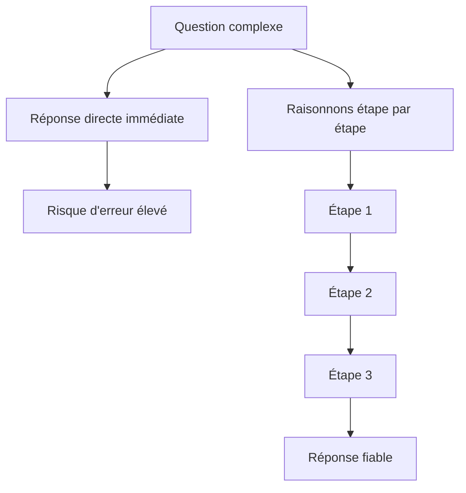

Les grands modèles de langage peuvent sembler magiques lorsqu'ils répondent instantanément à des questions complexes, mais cette instantanéité est parfois leur faiblesse. En les forçant à « penser à voix haute », en déroulant leur raisonnement étape par étape, on obtient des réponses bien plus fiables sur les tâches logiques, mathématiques et analytiques. C'est l'essence du **Chain-of-Thought** (CoT), ou raisonnement en chaîne.

## Qu'est-ce que le raisonnement en chaîne ?

Le Chain-of-Thought est une technique de prompting qui incite le modèle à produire une séquence d'étapes intermédiaires de raisonnement avant d'arriver à sa réponse finale. Plutôt que de demander directement « quelle est la réponse ? », vous demandez au modèle de montrer son cheminement.

Cette approche a été formalisée dans un article de recherche de Google en 2022 (*Chain-of-Thought Prompting Elicits Reasoning in Large Language Models*), qui a démontré des améliorations spectaculaires sur des benchmarks de raisonnement mathématique et logique.

```text
# Sans Chain-of-Thought
Question : Léa a 3 fois plus de billes que Marc. Marc a 8 billes.
Combien de billes ont-ils au total ?
Réponse :

# Avec Chain-of-Thought
Question : Léa a 3 fois plus de billes que Marc. Marc a 8 billes.
Combien de billes ont-ils au total ?
Raisonnons étape par étape :
```

La simple invitation « Raisonnons étape par étape » suffit souvent à déclencher un raisonnement bien plus rigoureux.

## Pourquoi "réfléchis étape par étape" améliore les réponses

Un LLM génère du texte token par token. Lorsqu'il produit directement une réponse chiffrée ou une conclusion, il n'a pas de « brouillon » : il s'engage sur une trajectoire dès le premier token. Le CoT change cela : en produisant un raisonnement intermédiaire visible, le modèle crée lui-même le contexte qui guide ses prochains tokens vers une conclusion plus juste.

<Note>
  Le Chain-of-Thought est particulièrement efficace sur les **grands modèles** (GPT-4, Claude 3, Gemini Ultra…). Sur les modèles plus petits, il peut produire des raisonnements plausibles mais incorrects, ce qu'on appelle le « raisonnement confiant mais faux ». Vérifiez toujours les étapes intermédiaires sur les tâches critiques.
</Note>

Concrètement, le CoT aide le modèle à :

- **Décomposer les problèmes** multi-étapes en sous-problèmes gérables.
- **Repérer ses propres erreurs** en relisant son raisonnement au fil de la génération.
- **Justifier ses conclusions**, rendant les erreurs plus faciles à identifier et corriger.

Le schéma ci-dessous oppose la réponse directe au raisonnement en chaîne :



## CoT standard vs Zero-shot CoT

Il existe deux manières principales d'activer le raisonnement en chaîne.

### CoT standard (few-shot)

Vous fournissez des exemples qui incluent explicitement le raisonnement intermédiaire :

```text
Question : Un train parcourt 120 km en 1h30. Quelle est sa vitesse moyenne ?
Raisonnement :
- La vitesse est la distance divisée par le temps.
- 1h30 = 1,5 heure.
- Vitesse = 120 ÷ 1,5 = 80 km/h.
Réponse : 80 km/h

Question : Une piscine de 50 000 litres se remplit au rythme de 200 litres/min.
Combien de temps faut-il pour la remplir à 80% ?
Raisonnement :
```

### Zero-shot CoT

Il suffit d'ajouter une phrase déclencheur à la fin de votre question. Les formulations les plus efficaces sont :

```text
# Formulations déclencheuses Zero-shot CoT
"Raisonnons étape par étape."
"Réfléchissons méthodiquement."
"Pensons à voix haute avant de répondre."
"Let's think step by step." (fonctionne très bien même en contexte français)
"Décomposons ce problème."
```

Le Zero-shot CoT est remarquablement puissant pour sa simplicité : une seule phrase peut diviser le taux d'erreur par deux sur des problèmes de raisonnement.

## Exemple pas à pas : résolution d'un problème

Voici comment un modèle guidé par CoT déroule un raisonnement logique.

**Prompt :**
```text
Sophie est plus jeune que Thomas. Thomas est plus vieux que Lucas.
Lucas est plus vieux que Sophie. Qui est le plus vieux des trois ?
Raisonnons étape par étape.
```

<Steps>
  <Step title="Lister les informations connues">
    Le modèle identifie les relations explicites :
    - Sophie < Thomas (Sophie est plus jeune que Thomas)
    - Lucas < Thomas (Thomas est plus vieux que Lucas)
    - Sophie < Lucas (Lucas est plus vieux que Sophie)
  </Step>
  <Step title="Établir un ordre partiel">
    En combinant les deux premières relations, on sait que Thomas est plus vieux à la fois que Sophie et que Lucas.
    La troisième relation précise la position relative de Sophie et Lucas : Sophie < Lucas.
  </Step>
  <Step title="Reconstruire l'ordre complet">
    En combinant toutes les relations :
    Sophie < Lucas < Thomas

    L'ordre complet du plus jeune au plus vieux est : Sophie, puis Lucas, puis Thomas.
  </Step>
  <Step title="Formuler la réponse finale">
    **Thomas est le plus vieux des trois.**

    Le raisonnement intermédiaire a permis d'éviter une erreur classique : confondre "Thomas est plus vieux que Lucas" avec "Lucas est le deuxième".
  </Step>
</Steps>

## Tree of Thought : aller au-delà du CoT linéaire

Le **Tree of Thought** (ToT) est une extension du CoT qui explore plusieurs branches de raisonnement en parallèle avant de choisir la plus prometteuse. Plutôt qu'une chaîne linéaire A → B → C, le modèle génère des alternatives à chaque étape et évalue leur pertinence.

```text
Système : Pour ce problème, génère 3 approches différentes 
pour commencer la résolution. Évalue brièvement chaque approche,
puis poursuis avec la plus prometteuse.
```

Le ToT est particulièrement utile pour les problèmes de planification, les puzzles et les tâches créatives où plusieurs chemins valides existent. Il est cependant plus coûteux en tokens et en temps d'inférence.

## Self-consistency : voter entre plusieurs raisonnements

La **self-consistency** pousse le CoT encore plus loin : au lieu de demander un seul raisonnement, vous en demandez plusieurs (en relançant plusieurs fois la même requête avec une température élevée), puis vous sélectionnez la réponse finale par vote majoritaire.

```text
# Stratégie self-consistency
1. Envoyez le même prompt CoT 5 fois (température 0.7-1.0)
2. Collectez les 5 réponses finales
3. Sélectionnez la réponse apparaissant le plus souvent

# Exemple de résultats
Tentative 1 → Réponse : 42
Tentative 2 → Réponse : 42
Tentative 3 → Réponse : 38
Tentative 4 → Réponse : 42
Tentative 5 → Réponse : 44

Vote majoritaire → Réponse finale : 42 ✅
```

Cette approche améliore significativement la fiabilité sur les tâches de raisonnement complexes, au prix d'un coût multiplié par le nombre de tentatives.

## Quand utiliser le Chain-of-Thought ?

Le CoT n'est pas toujours nécessaire. Voici un guide pratique :

| Type de tâche | CoT utile ? |
|---|---|
| Problèmes mathématiques multi-étapes | ✅ Fortement recommandé |
| Raisonnement logique / déduction | ✅ Fortement recommandé |
| Analyse de texte et argumentation | ✅ Recommandé |
| Questions factuelles simples | ❌ Surcharge inutile |
| Génération créative libre | ❌ Peut contraindre la créativité |
| Classification simple | ⚠️ Utile si les cas limites sont fréquents |

Le Chain-of-Thought est votre allié dès que la tâche requiert plusieurs étapes de déduction, de calcul ou d'analyse. Pour les tâches simples, la verbosité qu'il génère est souvent contre-productive.
