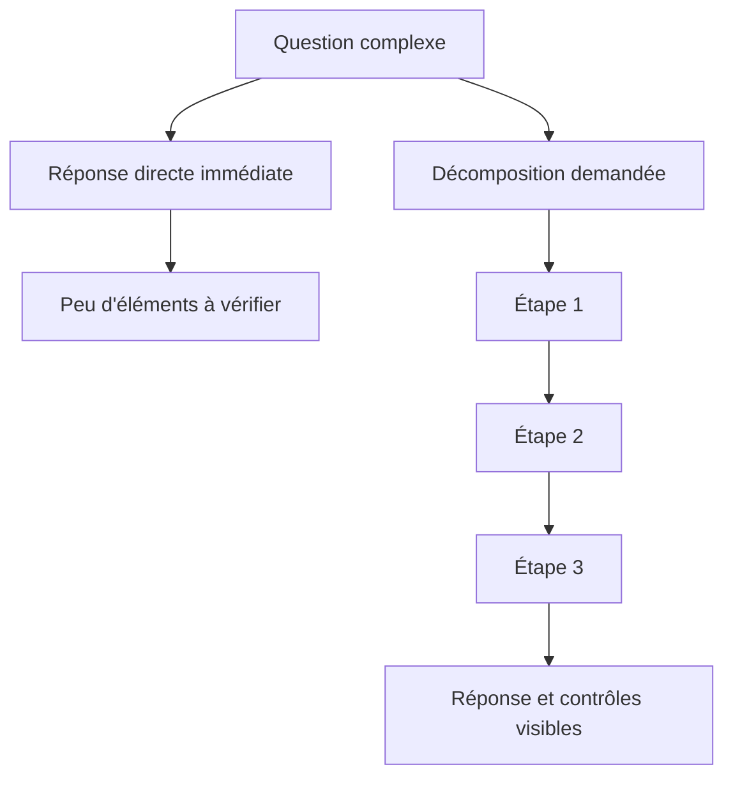

<Info>
  **Niveau** : Intermédiaire · **Prérequis** : [Few-shot learning](/prompt-engineering/few-shot-learning) · **Temps de lecture** : ~6 min
</Info>

Les grands modèles de langage peuvent répondre trop vite à une question complexe. Leur demander de **décomposer le problème** peut améliorer le résultat et, surtout, rendre les hypothèses et les calculs vérifiables. Cette famille de techniques est souvent appelée **Chain-of-Thought** (CoT), ou raisonnement en chaîne.

## Qu'est-ce que le raisonnement en chaîne ?

Le Chain-of-Thought est une technique de prompting qui incite le modèle à produire des étapes intermédiaires avant sa réponse finale. En pratique, demandez plutôt les **hypothèses, calculs et contrôles utiles** qu'un long monologue de « pensée ».

Cette approche a été formalisée dans un article de recherche de Google en 2022 (*Chain-of-Thought Prompting Elicits Reasoning in Large Language Models*). Elle a amélioré les résultats de certains grands modèles sur plusieurs benchmarks mathématiques et logiques. Le gain dépend toutefois du modèle, de la tâche et de la manière d'évaluer la réponse.

```text
# Sans Chain-of-Thought
Question : Léa a 3 fois plus de billes que Marc. Marc a 8 billes.
Combien de billes ont-ils au total ?
Réponse :

# Avec décomposition vérifiable
Question : Léa a 3 fois plus de billes que Marc. Marc a 8 billes.
Combien de billes ont-ils au total ?
Donne le calcul en trois lignes, puis vérifie le total :
```

Une consigne précise sur les étapes attendues est généralement plus utile qu'un simple « réfléchis étape par étape ».

## Pourquoi "réfléchis étape par étape" améliore les réponses

Un LLM génère du texte token par token. Une décomposition explicite lui fournit des résultats intermédiaires qu'il peut réutiliser dans la suite de sa réponse. Elle donne aussi au lecteur des éléments concrets à contrôler.

<Note>
  **Une explication produite n'est pas une radiographie du raisonnement interne.** Le modèle peut construire après coup une justification plausible d'une réponse fausse. Vérifiez les calculs, les sources et les hypothèses sur les tâches critiques.
</Note>

Concrètement, le CoT aide le modèle à :

- **Décomposer les problèmes** multi-étapes en sous-problèmes gérables.
- **Conserver des résultats intermédiaires** utiles pour la suite de la génération.
- **Rendre la réponse vérifiable**, afin que vous puissiez identifier et corriger une erreur.

Le schéma ci-dessous oppose la réponse directe au raisonnement en chaîne :



## CoT par exemples ou par instruction

Il existe deux manières principales d'activer le raisonnement en chaîne.

### CoT standard (few-shot)

Vous fournissez des exemples qui incluent explicitement le raisonnement intermédiaire :

```text
Question : Un train parcourt 120 km en 1h30. Quelle est sa vitesse moyenne ?
Raisonnement :
- La vitesse est la distance divisée par le temps.
- 1h30 = 1,5 heure.
- Vitesse = 120 ÷ 1,5 = 80 km/h.
Réponse : 80 km/h

Question : Une piscine de 50 000 litres se remplit au rythme de 200 litres/min.
Combien de temps faut-il pour la remplir à 80% ?
Raisonnement :
```

### Instruction de décomposition sans exemple

Sans fournir d'exemple, décrivez les éléments intermédiaires que vous voulez pouvoir contrôler :

```text
# Instructions de décomposition vérifiable
"Liste les hypothèses, effectue le calcul, puis vérifie l'unité."
"Compare les options selon les quatre critères du tableau."
"Donne une justification concise et indique ce qui reste incertain."
"Avant de conclure, cherche un contre-exemple à ta réponse."
```

Cette formulation cadre le résultat attendu. Elle ne garantit pas l'exactitude, mais elle facilite nettement le contrôle humain.

## Exemple pas à pas : résolution d'un problème

Voici comment un modèle guidé par CoT déroule un raisonnement logique.

**Prompt :**
```text
Sophie est plus jeune que Thomas. Thomas est plus vieux que Lucas.
Lucas est plus vieux que Sophie. Qui est le plus vieux des trois ?
Liste les relations, reconstruis l'ordre, puis donne la réponse.
```

<Steps>
  <Step title="Lister les informations connues">
    Le modèle identifie les relations explicites :
    - Sophie < Thomas (Sophie est plus jeune que Thomas)
    - Lucas < Thomas (Thomas est plus vieux que Lucas)
    - Sophie < Lucas (Lucas est plus vieux que Sophie)
  </Step>
  <Step title="Établir un ordre partiel">
    En combinant les deux premières relations, on sait que Thomas est plus vieux à la fois que Sophie et que Lucas.
    La troisième relation précise la position relative de Sophie et Lucas : Sophie < Lucas.
  </Step>
  <Step title="Reconstruire l'ordre complet">
    En combinant toutes les relations :
    Sophie < Lucas < Thomas

    L'ordre complet du plus jeune au plus vieux est : Sophie, puis Lucas, puis Thomas.
  </Step>
  <Step title="Formuler la réponse finale">
    **Thomas est le plus vieux des trois.**

    Le raisonnement intermédiaire a permis d'éviter une erreur classique : confondre "Thomas est plus vieux que Lucas" avec "Lucas est le deuxième".
  </Step>
</Steps>

## Tree of Thought : aller au-delà du CoT linéaire

Le **Tree of Thought** (ToT) est une extension du CoT qui explore plusieurs branches de raisonnement en parallèle avant de choisir la plus prometteuse. Plutôt qu'une chaîne linéaire A → B → C, le modèle génère des alternatives à chaque étape et évalue leur pertinence.

```text
Système : Pour ce problème, génère 3 approches différentes 
pour commencer la résolution. Évalue brièvement chaque approche,
puis poursuis avec la plus prometteuse.
```

Le ToT est particulièrement utile pour les problèmes de planification, les puzzles et les tâches créatives où plusieurs chemins valides existent. Il est cependant plus coûteux en tokens et en temps d'inférence.

## Self-consistency : voter entre plusieurs raisonnements

La **self-consistency** pousse le CoT encore plus loin : au lieu de demander un seul raisonnement, vous en demandez plusieurs (en relançant plusieurs fois la même requête avec une température élevée), puis vous sélectionnez la réponse finale par vote majoritaire.

```text
# Stratégie self-consistency
1. Envoyez le même prompt CoT 5 fois (température 0.7-1.0)
2. Collectez les 5 réponses finales
3. Sélectionnez la réponse apparaissant le plus souvent

# Exemple de résultats
Tentative 1 → Réponse : 42
Tentative 2 → Réponse : 42
Tentative 3 → Réponse : 38
Tentative 4 → Réponse : 42
Tentative 5 → Réponse : 44

Vote majoritaire → Réponse finale : 42 ✅
```

Cette approche améliore significativement la fiabilité sur les tâches de raisonnement complexes, au prix d'un coût multiplié par le nombre de tentatives.

## Quand utiliser le Chain-of-Thought ?

Le CoT n'est pas toujours nécessaire. Voici un guide pratique :

| Type de tâche | CoT utile ? |
|---|---|
| Problèmes mathématiques multi-étapes | ✅ Demandez calculs et vérification |
| Raisonnement logique / déduction | ✅ Demandez contraintes et conclusion |
| Analyse de texte et argumentation | ✅ Demandez critères et preuves |
| Questions factuelles simples | ❌ Surcharge inutile |
| Génération créative libre | ❌ Peut contraindre la créativité |
| Classification simple | ⚠️ Utile si les cas limites sont fréquents |

La décomposition est utile dès qu'une tâche exige plusieurs étapes de déduction, de calcul ou d'analyse. Pour une tâche simple, elle ajoute surtout de la longueur.

<Note>
  De nombreux modèles récents disposent d'un **raisonnement natif** ou d'un niveau d'effort réglable. Ils peuvent effectuer un travail interne avant de répondre, sans afficher une chaîne de pensée complète. Vous n'avez pas besoin de leur demander de révéler ce raisonnement. Demandez plutôt une réponse concise accompagnée des éléments vérifiables dont vous avez réellement besoin : hypothèses, calculs, critères, sources ou test final.
</Note>

## Exercice pratique

```text
Un magasin vend des tee-shirts à 15€ et propose une réduction de 20%
sur tous les articles à partir du 3ème acheté. Combien coûteront 5 tee-shirts ?
Explicite ton interprétation de « à partir du 3ème », montre le calcul,
puis vérifie le total avec une seconde méthode.
```

Essayez ensuite une version qui demande seulement la réponse. Comparez les résultats : l'interprétation de la remise est-elle la même ? La version structurée vous permet-elle de repérer plus facilement une éventuelle erreur ?

## Testez vos connaissances

<Accordion title="Quiz : une explication détaillée prouve-t-elle que la réponse du modèle est correcte ?">
  **Non.** Un modèle peut produire une justification cohérente mais fausse. Une bonne consigne demande des éléments contrôlables : hypothèses explicites, calculs, sources, critères et test final. La vérification reste indispensable dès que l'enjeu est important.
</Accordion>
